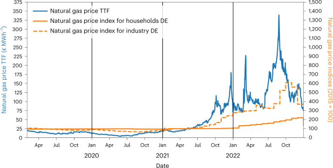

```{r setup, include=FALSE}
knitr::opts_chunk$set(echo = TRUE)
library(tidyverse)
library(lubridate)
```

## Overview

In the `data` directory of this project you will find the file from a paper published in *Nature Energy* titled [Natural gas savings in Germany during the 2022 energy crisis](https://www.nature.com/articles/s41560-023-01260-5). Here is the abstract of the article:

> Russia curbed its natural gas supply to Europe in 2021 and 2022, creating a grave energy crisis. This Article empirically estimates the crisis response of natural gas consumers in Germany—for decades, the largest export market for Russian gas. Using a multiple regression model, we estimate the response of small consumers, industry and power stations separately, controlling for the nonlinear temperature-heating relationship, seasonality and trends. We find significant and substantial gas savings for all consumer groups, but with differences in timing and size. For instance, industry started reducing consumption as early as September 2021, while small consumers saved substantially only since March 2022. Across all sectors, gas consumption during the second half of 2022 was 23% below the temperature-adjusted baseline. We discuss the drivers behind these savings and draw conclusions on their role in coping with the crisis.

Your job in this project falls into two categories:

1. A set of **tasks** that your group must complete exactly
2. A set of **objectives** that are more general in their approach.

## Tasks

### Task 1

Aden 

* Load two files. To work in the console, use the `Session -> Set Working Directory -> To Source File Location`.
    * Call the first table `daily`: "./data/natural_gas_germany_daily.csv"
    * Call the second table `gas`: "./data/dutch_ttf_natural_gas.csv". Be sure to properly import the `Date` column.
    * Demonstrate that these have been loaded by showing the number of rows and columns in each table.
    
```{r}
daily <- read_csv("./data/natural_gas_germany_daily.csv")
gas <- read_csv("./data/dutch_ttf_natural_gas.csv", col_types = cols(Date = col_date()))
```

```{r}
dim(daily)
dim(gas)
```
### Task 2

Aden

* The data in `daily` are collected over days, with information on different types of natural gas consumption (`consumption_small`, `consumption_industry`, `consumption_power`). Provide summaries of typical values for each of these three types of consumption.

```{r}
daily_summary <- daily %>%
  summarise(across(c(consumption_small, consumption_industry, consumption_power),
            list(mean = ~mean(., na.rm = TRUE),
                 sd = ~sd(., na.rm = TRUE),
                 min = ~min(., na.rm = TRUE),
                 median = ~median(., na.rm = TRUE),
                 max = ~max(., na.rm = TRUE))))
daily_summary
```

### Task 3

Aden
Answer some questions about the data in `daily`:

```{r}
colnames(daily)
colnames(gas)
```

* How many weeks do the data cover?

```{r}
date_range <- range(daily$date)
weeks <- as.numeric(difftime(date_range[2], date_range[1], units = "weeks"))
cat("Num of weeks:", round(weeks, 1), "\n")
```

* What is the percentage change in the `consumption_*` variables (that is the last day minus the first day divided by the first day)?

```{r}
first_non_na <- daily %>% 
  filter(!is.na(consumption_small)) %>% 
  slice(1) %>% 
  pull(consumption_small)

last_non_na <- daily %>% 
  filter(!is.na(consumption_small)) %>% 
  slice(n()) %>% 
  pull(consumption_small)

percentage_change_small <- round((last_non_na - first_non_na) / first_non_na * 100, 1)

cat("Percentage change (consumption small):", percentage_change_small, "%\n")
```

```{r}
first_day <- daily %>% slice(1)
last_day <- daily %>% slice(n())
percentage_change <- function(x, y) round((y - x)/x * 100, 1)
cat("Percentage change:\n",
    "consumption_industry:", percentage_change(first_day$consumption_industry, last_day$consumption_industry), "%\n",
    "consumption_power:", percentage_change(first_day$consumption_power, last_day$consumption_power), "%\n")
```

* What proportion of the days are marked as holidays?

```{r}
cat("Holidays Proportion:", mean(daily$holiday), "\n")
```

* For each month in each year, what was the year-month combination with the lowest median `consumption_power` value?

```{r}
lowest_consumption_power <- daily %>%
  mutate(year = year(date), month = month(date)) %>%
  group_by(year, month) %>%
  summarise(median_power = median(consumption_power, na.rm = TRUE)) %>%
  ungroup() %>%
  slice_min(median_power, n = 1)

lowest_consumption_power
```

### Task 4

Aden

* The original paper aggregated the data to monthly means for each consumption type in `daily` and the `Price` column of `gas` to produce the following image:<br/>
<br/>
Produce plots that show the same information that is presented in this plot. Your plots do not have to have the same colors or markings, but we should be able to use them to compare the trends for the three price variables. 

```{r}
gas_monthly <- gas %>%
  mutate(year_month = floor_date(Date, "month")) %>%
  group_by(year_month) %>%
  summarise(
    "Natural gas price TTF" = mean(Price, na.rm = TRUE)
  )

daily_monthly <- daily %>%
  mutate(year_month = floor_date(date, "month")) %>%
  group_by(year_month) %>%
  summarise(
    "Industry Index (2015=100)" = mean(price_industry_idx, na.rm = TRUE),
    "Household Index (2015=100)" = mean(price_households_idx, na.rm = TRUE)
  )

combined <- gas_monthly %>%
  full_join(daily_monthly, by = "year_month") %>%
  pivot_longer(
    cols = -year_month,
    names_to = "category",
    values_to = "value"
  )

max_ttf <- max(combined$value[combined$category == "Natural gas price TTF"], na.rm = TRUE)
max_index <- max(combined$value[combined$category != "Natural gas price TTF"], na.rm = TRUE)
scale_factor <- max_ttf / max_index

line_colors <- c(
  "Natural gas price TTF" = "red",
  "Industry Index (2015=100)" = "blue",
  "Household Index (2015=100)" = "green"
)

linetypes <- c(
  "Natural gas price TTF" = "solid",
  "Industry Index (2015=100)" = "longdash",
  "Household Index (2015=100)" = "dotdash"
)

ggplot(combined, aes(x = year_month, y = value, 
                    color = category, linetype = category)) +
  geom_line(linewidth = 0.8) +
  coord_cartesian(
    xlim = c(as.Date("2019-01-01"), as.Date("2022-12-31"))
  ) +
  scale_y_continuous(
    name = "Price Indices (2015 = 100)",
    limits = c(0, 1500),
    sec.axis = sec_axis(
      ~ . * scale_factor,
      name = "Natural gas price TTF (€ MWh⁻¹)",
      breaks = seq(0, 375, 25)
    )
  ) +
  scale_x_date(
    name = NULL,
    date_breaks = "3 months",
    date_labels = "%b\n%Y",
    expand = expansion(mult = c(0.02, 0.02))
  ) +
  
  scale_color_manual(values = line_colors) +
  scale_linetype_manual(values = linetypes) +
  ggtitle("Natural Gas Price Monthly Trends") +
  theme_minimal(base_size = 12) +
  theme(
    legend.position = "top",
    legend.title = element_blank(),
    legend.key.width = unit(2.5, "cm"),
    legend.spacing.x = unit(1, "cm"),
    axis.text.x = element_text(angle = 45, hjust = 1),
    panel.grid.major = element_line(color = "grey"),
    plot.title = element_text(hjust = 0.5, face = "bold", size = 14),
    plot.margin = margin(t=20, r=20, b=20, l=20)
  ) +
  theme(
    plot.margin = margin(t=20, r=20, b=30, l=20),
    axis.text.x = element_text(angle = 45, hjust = 1, vjust = 1)
  )
```

### Task 5

Aden

* Write a predicate function that returns true if any value in vector is missing. Use this function to find columns with missing values in the `daily` column. Create a plot or table that shows how often patterns of missingness occur: are all of the missing values in the same rows or are the various columns missing data in different ways?

```{r}
has_any_na <- function(x) any(is.na(x))

cols_missing <- daily %>% summarise(across(everything(), has_any_na)) %>%
  pivot_longer(everything(), names_to = "column", values_to = "missing") %>%
  filter(missing)

cat("Missing value columns:", cols_missing$column, "\n")

#table

missing_data <- daily %>%
  select(cols_missing$column) %>%
  mutate(across(everything(), is.na))

missing_patterns <- missing_data %>%
  group_by(across(everything())) %>%
  count()

missing_patterns

#plot

missing_data_long <- missing_data %>%
  mutate(row = row_number()) %>%
  pivot_longer(-row, names_to = "column", values_to = "missing")

ggplot(missing_data_long, aes(x = column, y = row, fill = missing)) +
  geom_tile() +
  scale_fill_manual(values = c("TRUE" = "green", "FALSE" = "red")) +
  labs(title = "Missing Values by Row & Column", x = "Column", y = "Row") +
  theme_minimal() +
  theme(
    axis.text.x = element_text(angle = 45, hjust = 1),
    plot.margin = margin(t = 10, r = 10, b = 30, l = 10),
    axis.title.x = element_text(margin = margin(t = 15))
  )
```

### Task 6

Shaurya

* Limit the `gas` table to days where the price exceeded the yearly median. Use the concept of [circular means](https://en.wikipedia.org/wiki/Circular_mean) to compute the average day of the year when price exceeds the yearly median price. The `yday` function will likely be useful here. 

```{r}


```


### Task 7

Shaurya

* Using the cut function, create two nominal variables from quantitative data in the `daily` dataset. Use these groups to summarize the data. Use arrange to show the smallest or largest values in these comparisons.

```{r}
# Create nominal variables from continuous data using quartile-based breaks
daily <- daily %>%
  mutate(
    small_cat = cut(consumption_small,
                    breaks = quantile(consumption_small, probs = seq(0, 1, by = 0.25), na.rm = TRUE),
                    include.lowest = TRUE,
                    labels = c("Low", "Medium-Low", "Medium-High", "High")),
    power_cat = cut(consumption_power,
                    breaks = quantile(consumption_power, probs = seq(0, 1, by = 0.25), na.rm = TRUE),
                    include.lowest = TRUE,
                    labels = c("Low", "Medium-Low", "Medium-High", "High"))
  )

# Summarize consumption_small by the new 'small_cat' groups
summary_small <- daily %>%
  group_by(small_cat) %>%
  summarise(
    count = n(),
    avg_small = mean(consumption_small, na.rm = TRUE)
  ) %>%
  arrange(avg_small)  # Arranged by increasing average consumption

# Summarize consumption_power by the new 'power_cat' groups
summary_power <- daily %>%
  group_by(power_cat) %>%
  summarise(
    count = n(),
    avg_power = mean(consumption_power, na.rm = TRUE)
  ) %>%
  arrange(desc(avg_power))  # Arranged by decreasing average consumption

# Display the summaries
print(summary_small)
print(summary_power)


```

### Task 8

Shaurya

* There are several variables that pull out data by different industry (the `_idx` columns). Create a table for these columns using `select` and the `ends_with` function. Provide two different plots that show of the relations between these variables (you do not need to have all variables in each plot).

```{r}
# 1. Create a table containing only the _idx columns
idx_table <- daily %>% select(ends_with("_idx"))
print(idx_table)

plot_data <- daily %>%
  mutate(Year = lubridate::year(date)) %>%
  filter(!is.na(manufacturing_idx), !is.na(retail_idx))

ggplot(plot_data, aes(x = manufacturing_idx, y = retail_idx)) +
  geom_point(alpha = 0.4) +
  geom_smooth(method = "lm", se = FALSE, color = "red") +
  facet_wrap(~Year) +
  labs(
    title = "Manufacturing vs. Retail Index Faceted by Year",
    x = "Manufacturing Index",
    y = "Retail Index"
  ) +
  theme_minimal()

# 3. Plot 2: Time Series Comparison for All _idx Columns
# Reshape and remove missing values
daily_idx_long <- daily %>% 
  select(date, ends_with("_idx")) %>%
  pivot_longer(cols = ends_with("_idx"), names_to = "Index_Type", values_to = "Value") %>%
  filter(!is.na(Value))

time_series_plot <- ggplot(daily_idx_long, aes(x = date, y = Value, color = Index_Type)) +
  geom_line() +
  labs(
    title = "Time Series of Price Indices",
    x = "Date",
    y = "Index Value"
  ) +
  theme_minimal()
print(time_series_plot)

```


## Objectives

### Objective 1

Hania

* Produce at least five more figures. For each figure, write a brief caption explaining the plot and what you have learned from the plot. Each figure should attempt to provide new insight into the data set not included elsewhere
    * A marginal distribution
    * A joint distribution
    * A plot of a summary measure such as a conditional mean
    * A plot using `facet_wrap` or `facet_grid`
    * A plot that shows seasonal effects before the crisis (September 2021 until October 2022)
    

```{r o1f1, echo = TRUE}
# Marginal distribution
daily %>%
  ggplot(aes(x = consumption_power)) +
  geom_density()
```
From the marginal distribution of the consumption power variable, we can see that the distribution is right-skewed. This means that the majority of the data points are concentrated on the lower end of the consumption power scale, and there are few values that are very high. This is likely due to the fact that there are a few outliers in the data that are driving the mean up. 

```{r}
# Joint distribution
daily %>%
  ggplot(aes(x = temperature, y = consumption_power)) +
  geom_point()
```
From the joint distibution of the consumption power and temperature, we can see that there is a negative correlation between the two variables. This means that as the temperature increases, the consumption power decreases. This is likely due to the fact that people use less electricity when it is warmer outside, and this maybe means that people do not use their power for air conditioning (or siply do not have air conditioning).

```{r}
# Conditional mean
daily %>%
  group_by(weekday) %>%
  summarise(mean_profiles = mean(heating_profiles)) %>%
  ggplot(aes(x = weekday, y = mean_profiles)) +
  geom_point()
```
The plot above shows, by weekday, how the mean heating profiles differed in the dataset. From the conditional mean plot, we can see that the heating profiles are lowest on the weekends and highest on the weekdays. This could possibly be due to the fact that people are away from home during the weekdays moreso during the year and use less electricity, or that they are more conscious about how they use their electricity on the weekends, when they are home. 
```{r}
# Facet wrap
daily %>%
  group_by(christmas_period) %>%
  ggplot(aes(x = consumption_power)) +
  geom_boxplot() +
facet_wrap(~christmas_period, labeller = label_both)
```
This plots above display the box-plot distibutions of consumption power according to if there is a christmas period or not. From the facet wrap plot, we can see that the median consumption power of data points is lower during the Christmas period than during the rest of the year. This is likely due to the fact that people are away from home during the Christmas period, so they use less electricity. 

```{r}
# A plot that shows seasonal effects before the crisis (September 2021 until October 2022)

daily %>%
  filter(date > "2021-09-01") %>%
  filter(date < "2022-10-01") %>%
  group_by(month) %>%
  ggplot(aes(x = month, y = consumption_power)) +
geom_point() +
coord_polar()
  

```
The above polar coordinate plot shows how the mean power, by month, differed in the dataset. From the plot of the seasonal effects on the consumption power before the crisis, it is clear that the consumption power is, on average, highest in the winter months and lowest in the summer months. This is obvios from the plot due to the lenggths of plot lines within each month being longest for months 11, 12, and 1 This is likely due to the increased use of heating in the winter months and the decreased use of heating in the summer months. This is a common trend in many countries, as people tend to use more electricity for heating during the winter months and less electricity for cooling during the summer months. 


### Objective 2

Shaurya

* Compare and contrast holidays and non-holidays for household energy consumption. Select 3 ways of comparing these groups. Provide at least one graph.

```{r}
library(tidyverse)
library(lubridate)

# 1. Compute summary statistics by holiday vs. non-holiday
summary_stats <- daily %>%
  group_by(holiday) %>%
  summarise(
    count = n(),
    mean_consumption = mean(consumption_small, na.rm = TRUE),
    median_consumption = median(consumption_small, na.rm = TRUE),
    sd_consumption = sd(consumption_small, na.rm = TRUE)
  )
print(summary_stats)

# 2. Boxplot to compare household consumption (consumption_small) by holiday status
boxplot_consumption <- ggplot(daily, aes(x = factor(holiday, labels = c("Non-Holiday", "Holiday")), y = consumption_small)) +
  geom_boxplot(fill = c("lightblue", "salmon")) +
  labs(
    title = "Household Energy Consumption on Holidays vs. Non-Holidays",
    x = "Holiday Status",
    y = "Consumption (small consumers)"
  ) +
  theme_minimal()
print(boxplot_consumption)

# 3. Density plot to compare the distributions
density_plot <- ggplot(daily, aes(x = consumption_small, fill = factor(holiday, labels = c("Non-Holiday", "Holiday")))) +
  geom_density(alpha = 0.5) +
  labs(
    title = "Density Plot of Household Energy Consumption",
    x = "Consumption (small consumers)",
    fill = "Holiday Status"
  ) +
  theme_minimal()
print(density_plot)

```

Through the summary statistics, we can see that we have collected less data on household electricity consumption during holidays. This suggests that the data might have some biases. The summary statistics provide a numerical snapshot to compare the two groups, and we can see that the mean consumption, median consumption, and standard deviation are all lower during holidays.

The boxplot gives us a better summary of the data's spread. We observe that even though the medians are nearly identical, the IQR for consumption during non-holidays is larger than during holidays. Furthermore, the non-holiday data has more outliers, which might be due to having more data from non-holiday periods.

The shape of the density plot differs between the holiday and non-holiday periods, indicating distinct usage patterns. While both distributions share a primary peak at roughly the same value, the second peak is smaller during the holiday period. This suggests that higher consumption values are less common on holidays compared to non-holidays.

### Objective 3

Shaurya

* According to the paper, the gas crisis occurred between September 2021 until October 2022. Compare this period with the periods before and after on household and industrial consumption. Write a paragraph explaining your findings.


```{r}
crisis_start <- as.Date("2021-09-01")
crisis_end <- as.Date("2022-10-31")

# Categorize time periods
daily <- daily %>%
  mutate(period = case_when(
    date < crisis_start ~ "Before Crisis",
    date >= crisis_start & date <= crisis_end ~ "During Crisis",
    date > crisis_end ~ "After Crisis"
  ))

# Compute summary statistics for household and industrial consumption
summary_stats <- daily %>%
  group_by(period) %>%
  summarise(
    mean_household = mean(consumption_small, na.rm = TRUE),
    median_household = median(consumption_small, na.rm = TRUE),
    sd_household = sd(consumption_small, na.rm = TRUE),
    mean_industry = mean(consumption_industry, na.rm = TRUE),
    median_industry = median(consumption_industry, na.rm = TRUE),
    sd_industry = sd(consumption_industry, na.rm = TRUE)
  )
print(summary_stats)


```

```{r}
daily_long <- daily %>%
  select(date, period, consumption_small, consumption_industry) %>%
  pivot_longer(
    cols = starts_with("consumption_"),
    names_to = "consumption_type",
    values_to = "consumption"
  ) %>%
  # Make the consumption_type names a bit prettier for plots
  mutate(consumption_type = recode(consumption_type,
                                   "consumption_small" = "Household",
                                   "consumption_industry" = "Industrial"))

# 1. Box Plot Comparison by Period
boxplot_consumption <- ggplot(daily_long, aes(x = period, y = consumption, fill = period)) +
  geom_boxplot(alpha = 0.7, outlier.shape = 21, outlier.color = "black") +
  facet_wrap(~ consumption_type, scales = "free_y") +
  labs(
    title = "Household and Industrial Consumption by Period",
    x = "Period",
    y = "Consumption"
  ) +
  theme_minimal(base_size = 12) +
  theme(
    legend.position = "none",
    plot.title = element_text(face = "bold", hjust = 0.5)
  )
print(boxplot_consumption)


```


In the box plot, we can see that there was a slight drop in energy consumption for both households and industries during the crisis. However, after the crisis, household electricity consumption increased significantly, whereas industrial energy consumption remained largely unchanged. Interestingly, for households, the 25th and 75th percentiles of electricity usage were nearly identical before and during the crisis, and both increased sharply after the crisis.

### Objective 4

Shaurya

* Explore the [documentation for ggplot](https://ggplot2.tidyverse.org/). Select one geometery and one `stat_` function we have not used before or use an option to a previously used geometry/stat with a new option. Write a short paragraph explaining what the plots show. 

```{r}
ggplot(daily, aes(x = consumption_small, color = factor(holiday, labels = c("Non-Holiday", "Holiday")))) +
  stat_ecdf(size = 1) +
  labs(
    title = "Empirical Cumulative Distribution of Household Consumption",
    subtitle = "Comparing Holidays vs. Non-Holidays",
    x = "Household Consumption",
    y = "Proportion of Observations",
    color = "Holiday Status"
  ) +
  theme_minimal(base_size = 13)


```


For mid-range consumption (roughly 0.75 to 1.75 units), the holiday ECDF curve is shifted to the left of the non-holiday curve. This means that for any given percentile, the consumption level on holidays is lower than that on non-holidays. Equivalently, at a fixed consumption level within this range, a higher proportion of holiday days fall below that level compared to non-holiday days. In other words, holidays tend to have lower consumption values than non-holidays in this mid-range.


### Objective 4

Hania

* Investigate solar radiation's marginal distribution and also it's relationship with temperature.

```{r}
daily %>%
  ggplot(aes(x = solar_radiation)) +
geom_density(fill = "skyblue", color = "black") +
  labs(title = "Marginal Distribution (Density)", x = "Solar Radiation", y = "Density")

daily %>%
  ggplot(aes(x = temperature, y = solar_radiation)) +
  geom_point() +
  geom_smooth() +
  labs(title = "Joint Distribution (Scatter Plot)", x = "Temperature", y = "Solar Radiation") 
  

```

The above plots show the marginal distribution of solar radiation from the data and the scatterplot showing the relationship between solar adiation and temperature. From the marginal distribution of solar radiation, we can see that the distribution is right-skewed. This means that the majority of the data points are concentrated on the lower end of the solar radiation scale, but that there are some values that are also very high. From the joint distribution of solar radiation and temperature, we can see that there is a positive correlation between the two variables. This means that as the temperature increases, the solar radiation also increases. This is likely due to the fact that the sun is hotter in the summer months, which leads to higher temperatures and more solar radiation.

### Objective 5

Hania

* Use `group_by` to summarize by a new feature of this data set not otherwise discussed in the tasks or objectives. What have you learned with these investigation?
q: make a faceted plot of the standard deviations of the `wages` variable by the `holiday` variable. 


```{r}
daily %>% 
  group_by(holiday) %>% 
  summarise(mean_hosp = mean(hospitality_idx)) %>% 
  ggplot(aes(x = weekday, y = mean_hosp)) + 
  geom_point() +
  facet_wrap(~holiday, labeller = label_both)
```

### Objective 6


* Based on your exploration of the data, suggest three questions that could be asked from these data or additional data that you can imagine. Be sure to explain why the previous plots or calculations indicates that this would be an interesting our useful exploration.

One question I could ask based on my exploration of the data is how the consumption power changes over time throughout the data. From the plots I have created, I can see that the consumption power is highest in the winter months and lowest in the summer months. This is likely due to the increased use of heating in the summer months. I also confirmed this from a plot in question .However, I am curious how this changed over the course of history in this dataset. Another question I could ask is how the consumption power changes with the temperature. From the joint distribution of the consumption power and temperature, I can see that there is a negative correlation between the two variables. This means that as the temperature increases, the consumption power decreases. However, I could investigate how this relationship varies according to the presence of holidays or not. Finally, I could ask how the consumption power changes with the solar radiation. From the joint distribution of the consumption power and solar radiation, I can see that there is a positive correlation between the two variables. This means that as the solar radiation increases, the consumption power also increases. So, a question I could ask is the exact amount by which on average solar radiation differs by month. 


### Objective 7

Hania

* Write an abstract for your project. Briefly explain what you did, what you found, and why a potential reader should be interested in your research.


